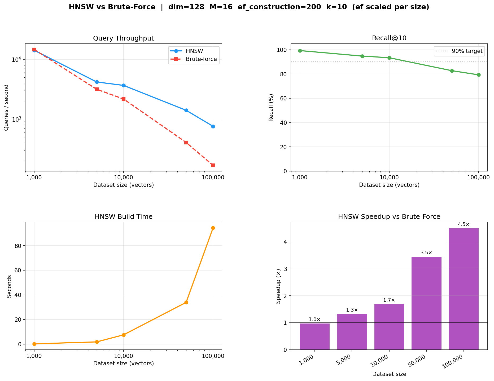

# VecDB — Lightweight Vector Database with HNSW Indexing

A vector database built from scratch in Python with a C++ core. No FAISS, no Chroma, no Pinecone. The HNSW approximate nearest-neighbour index is implemented from scratch following the original paper.

> **Reference:** Malkov & Yashunin, *"Efficient and robust approximate nearest neighbor search using Hierarchical Navigable Small World graphs"*, IEEE TPAMI 2018. [arXiv:1603.09320](https://arxiv.org/abs/1603.09320)

---

## Architecture

```
┌─────────────────────────────────────────────────────────────┐
│                        FastAPI Server                        │
│  POST /insert   POST /query   DELETE /delete   GET /health  │
└────────────────────────┬────────────────────────────────────┘
                         │
┌────────────────────────▼────────────────────────────────────┐
│                       VectorDB (Python)                      │
│                                                              │
│  ┌─────────────────┐   ┌──────────┐   ┌──────────────────┐  │
│  │ sentence-transf.│   │   WAL    │   │  Disk snapshot   │  │
│  │ (text → float32)│   │ (binary) │   │  (.npz + .json)  │  │
│  └────────┬────────┘   └──────────┘   └──────────────────┘  │
│           │                                                   │
│  ┌────────▼────────────────────────────────────────────────┐ │
│  │              hnsw_index (C++ via pybind11)              │ │
│  │                                                          │ │
│  │  • Multi-layer navigable small world graph               │ │
│  │  • INSERT  (Algorithm 1 — random level, beam build)      │ │
│  │  • SEARCH  (Algorithm 5 — greedy descent + ef beam)      │ │
│  │  • SELECT-NEIGHBORS-HEURISTIC (Algorithm 4)              │ │
│  │  • Lazy deletion (O(1) remove)                           │ │
│  └─────────────────────────────────────────────────────────┘ │
└─────────────────────────────────────────────────────────────┘
```

### How HNSW works (in brief)

HNSW builds a hierarchy of graphs. Each vector is assigned to a random maximum layer `l ~ floor(-ln(U) * mL)` where `mL = 1/ln(M)`. At each layer ≤ l the node is connected to its `M` nearest neighbours found by a greedy beam search. Querying descends greedily from the top layer to layer 0, where a wider beam (`ef`) is used to collect the k-nearest candidates.

This gives **O(log N)** search complexity instead of O(N) for brute force, at the cost of approximate (not exact) results controlled by the `ef` parameter.

---

## Benchmark Results

Measured on Apple M3 Pro, dim=128, M=16, ef_construction=200, k=10.  
Brute-force is a pure-Python per-query scan (same conditions as HNSW).



| Dataset size | HNSW QPS | BF QPS | Recall@10 | Speedup |
|:---:|:---:|:---:|:---:|:---:|
| 1,000 | 14,151 | 14,606 | 99.3% | 1.0× |
| 5,000 | 4,170 | 3,147 | 94.7% | 1.3× |
| 10,000 | 3,650 | 2,160 | 93.4% | 1.7× |
| 50,000 | 1,400 | 406 | 82.7% | 3.5× |
| 100,000 | 755 | 168 | 79.3% | 4.5× |

`ef` is a runtime parameter — increase it for better recall at the cost of lower throughput. Results above use `ef` scaled from 64 (1k) to 350 (100k).

---

## Getting started

### Requirements

- Python 3.9+
- A C++17 compiler (clang on macOS, g++ on Linux)
- pybind11

```bash
pip install -r requirements.txt
```

### Build the C++ extension

```bash
# macOS (arm64)
ARCHFLAGS="-arch arm64" python3 setup.py build_ext --inplace

# Linux
python3 setup.py build_ext --inplace
```

### Run the server

```bash
uvicorn server:app --host 0.0.0.0 --port 8000
```

Environment variables:

| Variable | Default | Description |
|---|---|---|
| `VECDB_DATA_DIR` | `data` | Directory for WAL and index snapshots |
| `VECDB_DIM` | `384` | Vector dimensionality |
| `VECDB_M` | `16` | HNSW M parameter |
| `VECDB_EF_CONST` | `200` | HNSW ef_construction parameter |
| `VECDB_MODEL` | `all-MiniLM-L6-v2` | sentence-transformers model |

---

## API

### `POST /insert`

Encode text and insert into the index.

```bash
curl -X POST http://localhost:8000/insert \
  -H "Content-Type: application/json" \
  -d '{"text": "HNSW graphs provide approximate nearest neighbour search", "metadata": {"source": "docs"}}'
```

```json
{"id": 0, "message": "inserted"}
```

### `POST /query`

Encode text and return the k nearest neighbours.

```bash
curl -X POST http://localhost:8000/query \
  -H "Content-Type: application/json" \
  -d '{"text": "approximate nearest neighbor search", "k": 3}'
```

```json
{
  "results": [
    {"id": 0, "distance": 0.121, "text": "HNSW graphs provide...", "metadata": {...}},
    {"id": 2, "distance": 0.453, "text": "Vector databases...", "metadata": {...}},
    {"id": 1, "distance": 0.812, "text": "Machine learning...", "metadata": {...}}
  ]
}
```

### `DELETE /delete/{id}`

Remove a node by id (O(1) lazy deletion).

```bash
curl -X DELETE http://localhost:8000/delete/0
```

### `GET /health`

```bash
curl http://localhost:8000/health
# {"status": "ok", "size": 5}
```

---

## Use as a library

```python
from vecdb import VectorDB

db = VectorDB(data_dir="data", dim=384)

# Insert text
id0 = db.insert("semantic search with vector embeddings", metadata={"tag": "nlp"})
id1 = db.insert("approximate nearest neighbour graphs")

# Query
results = db.query("vector similarity search", k=2)
for r in results:
    print(r["distance"], r["text"])

# Insert raw vectors (no encoder needed)
import numpy as np
vec = np.random.rand(384).astype(np.float32)
db.insert_vector(vec, metadata={"source": "raw"})

# Delete
db.delete(id0)

# Persist to disk
db.save()
```

---

## Crash recovery (WAL)

Every insert and delete is written to a binary write-ahead log (`vecdb.wal`) before being applied to the index. On startup, any records not yet included in the last snapshot are replayed automatically.

```
[VectorDB] Loaded snapshot: 0 entries
[WAL] Replayed 50 record(s) from data/vecdb.wal
```

Call `db.save()` (or `db.close()`) to checkpoint the current state and truncate the WAL.

---

## Tests

```bash
# C++ core: 1000-vector insert + recall vs brute-force
python3 tests/test_hnsw_core.py

# WAL crash-recovery
python3 tests/test_wal.py

# FastAPI layer (in-process, no network)
python3 tests/test_api.py
```

---

## Benchmark

```bash
python3 scripts/benchmark.py
```

Runs across dataset sizes [1k, 5k, 10k, 50k, 100k] and saves `scripts/benchmark_results.png`. Uncomment the 500k/1M lines in the script if your machine can handle it.

---

## Project structure

```
.
├── src/
│   ├── hnsw/
│   │   ├── hnsw.h          # HNSW index interface
│   │   └── hnsw.cpp        # INSERT, SEARCH, SELECT-NEIGHBORS algorithms
│   └── bindings/
│       └── bindings.cpp    # pybind11 bindings
├── vecdb/
│   ├── __init__.py
│   └── db.py               # VectorDB: encoding, WAL, persistence
├── server.py               # FastAPI REST layer
├── tests/
│   ├── test_hnsw_core.py   # C++ core smoke test
│   ├── test_wal.py         # WAL crash-recovery test
│   └── test_api.py         # API integration test
├── scripts/
│   └── benchmark.py        # Recall + throughput benchmark
├── setup.py                # pybind11 build configuration
└── requirements.txt
```
